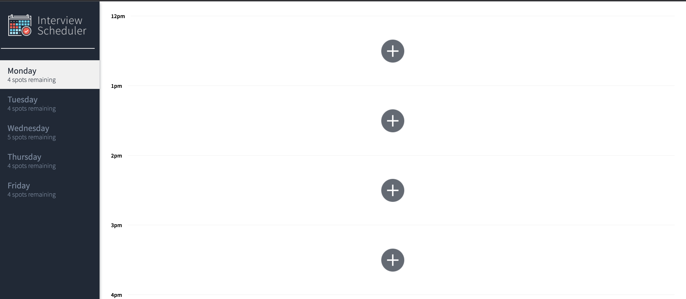
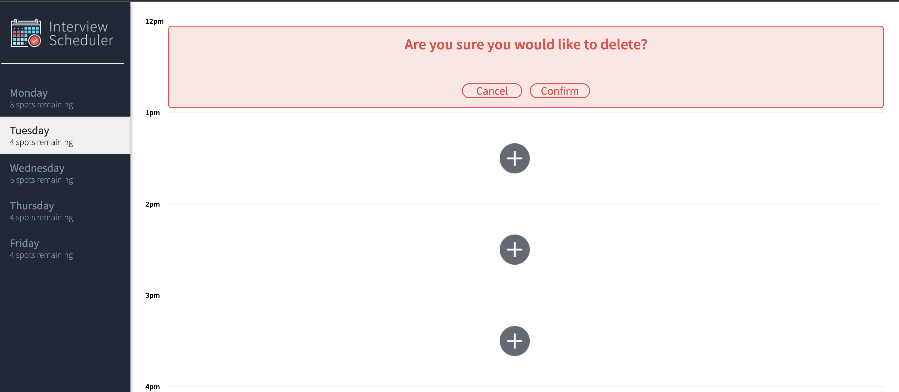
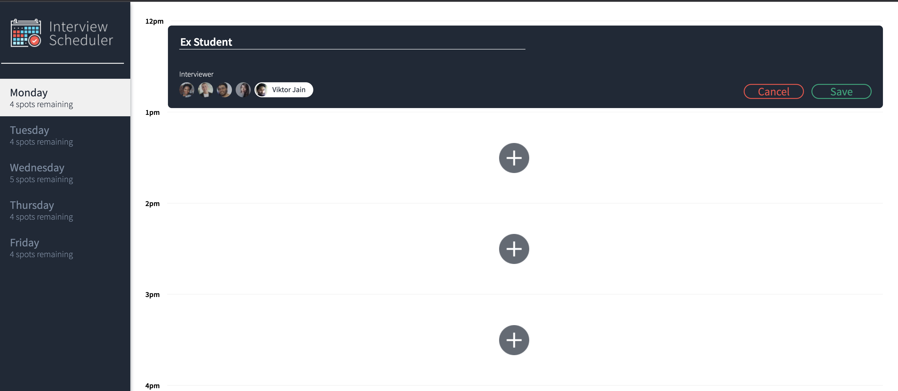

# Interview Scheduler

With this application, a student can create, edit and delete interview appointments.

## Setup

Install dependencies with `npm install`.

## Running Webpack Development Server

npm start

## Running Jest Test Framework

npm test

## Running Storybook Visual Testbed

npm run storybook

## ScreenShots

